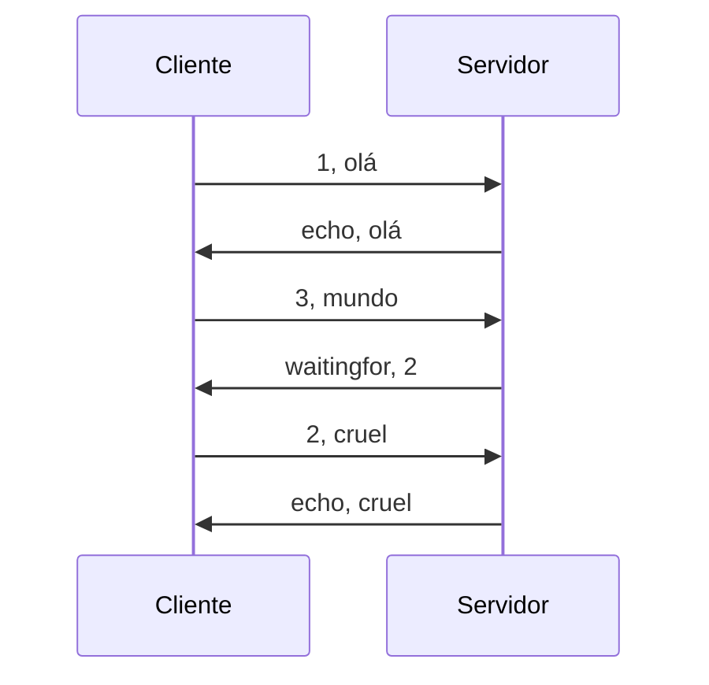

*Sistemas Distribuídos · Ficha prática*

# Tarefa UDP001

# Comunicação baseada em Datagramas

Construir, ao nível da aplicação, a garantia de ordenação que o UDP não oferece.

`UDP` · `Datagramas` · `Programação`

---

## Enquadramento

Existem 2 **modelos** de **comunicação** entre processos num sistema distribuído: **Datagramas** e **Stream**. Esta ficha aborda o modelo baseado em **datagramas**.

Qualquer modelo de comunicação depende de um protocolo de comunicação. O **UDP** é um protocolo **não orientado à conexão** baseado em **datagramas**: as mensagens são enviadas em *chunks* independentes, sendo posteriormente agregadas (ou não) pelos destinatários.

### Modelo de integridade

No UDP as **mensagens**:

- podem ser **corrompidas**, mas são **detetadas através de *checksums***;
- podem ser **duplicadas**;
- podem ser **perdidas** (ex.: **erros de checksum** ou ***buffer overflows***).

### Outras características

No UDP as mensagens podem ser **recebidas fora de ordem**. Para além disso, os problemas de **integridade** e de **ordenação de mensagens** têm de ser **resolvidos ao nível da aplicação**.

### Comportamento pretendido

O diagrama seguinte mostra o **resultado final** a que esta tarefa conduz: o servidor aceita a mensagem esperada e devolve-a; quando recebe uma mensagem adiantada, responde a indicar qual é a que falta.



> Troca de mensagens entre cliente e servidor, com deteção de uma mensagem fora de ordem.

---

## 1 · Objetivos

No final desta tarefa, o aluno deve ser capaz de:

1. **Compreender** o modelo de comunicação por **datagramas**.
2. **Explicar o modelo de falhas do UDP** (omissão, duplicação, corrupção e desordenação) e **relacionar** cada tipo de falha com a sua origem (perda em rede, *buffer overflow*, erro de *checksum*, caminhos distintos na rede).
3. **Implementar** um cliente e um servidor UDP em Java, utilizando corretamente `DatagramSocket` e `DatagramPacket`, e **justificar** o papel de cada parâmetro (endereço, porto, *buffer*, comprimento).
4. **Projetar um protocolo aplicacional simples** (formato de mensagem + regras de resposta) que acrescente, **ao nível da aplicação**, uma garantia que o UDP não dá: a **deteção de mensagens fora de ordem**.
5. **Manter estado** no servidor (o número da última mensagem aceite em ordem) e **decidir**, para cada datagrama recebido, se é aceite ou se origina um pedido de retransmissão.
6. **Testar e demonstrar** o comportamento do sistema em cenários normais e em cenários de desordenação provocada, **interpretando** os resultados obtidos.
7. **Reconhecer os limites** da solução construída, identificando pelo menos um caso que o mecanismo implementado *não* resolve (ex.: duplicação, perda silenciosa, múltiplos clientes).

---

## 2 · Critérios de aceitação

A tarefa é considerada cumprida quando o aluno, perante o seu trabalho, evidencia os cinco pontos seguintes. Servem igualmente de **guião para uma avaliação oral**.

1. `CA1` **Explica**, sem recorrer ao código, por que razão o UDP não garante ordem e dá um exemplo de duas mensagens enviadas em sequência que chegam trocadas.
2. `CA2` **Justifica** as decisões da API: porto fixo no servidor e não no cliente, comprimento do *buffer* versus comprimento dos dados recebidos, e origem do endereço e porto usados na resposta.
3. `CA3` **Enuncia numa frase** a regra de decisão do servidor e indica o estado mínimo que este guarda (o valor de **L**), incluindo o seu valor inicial e o que esse valor significa.
4. `CA4` **Demonstra** o sistema a responder com *echo* na sequência 1, 2, 3 e com `waitingfor` na sequência 1, 3, 2, continuando a servir pedidos depois do erro, e **interpreta** o que observou.
5. `CA5` **Aponta uma limitação** da solução — um problema do UDP que o mecanismo implementado *não* resolve (duplicados, perdas ou vários clientes) — e **esboça** como o resolveria.

> **Nota:** Um trabalho que produza o resultado correto mas cujo autor não consiga responder aos pontos anteriores não satisfaz os critérios de aceitação.

---

## 3 · Apoio à aprendizagem

Se utilizares um assistente de IA como apoio, utiliza **o prompt seguinte**. Ele foi escrito para te ajudar a *pensar* e a *compreender*. Copia-o integralmente para o início da conversa de uma ferramenta de IA.

**Prompt para o assistente** *(copiar na íntegra)*

```
Estou a realizar uma tarefa da unidade curricular de Sistemas Distribuídos sobre
comunicação por datagramas (UDP) em Java. Tenho de implementar, em DOIS projetos
Java separados que correm como processos independentes, um cliente e um servidor
UDP e, sobre eles, um mecanismo aplicacional de deteção de mensagens fora de
ordem.

ESPECIFICAÇÃO QUE TENHO DE CUMPRIR
(é o meu alvo: não a alteres, não a simplifiques e não me proponhas alternativas)

- Cada mensagem enviada pelo cliente tem o formato:   <N>,<mensagem>
  em que N é o número de sequência dessa mensagem.
- O servidor guarda L, o número da última mensagem que recebeu em ordem.
- Se N for igual a L+1, o servidor devolve a mensagem (echo) e atualiza o estado.
- Se N for diferente de L+1, o servidor responde:     waitingfor,<L+1>
- O servidor não pode terminar nem ficar num estado inconsistente perante uma
  mensagem mal formada ou fora de ordem: tem de continuar a servir os pedidos
  seguintes.

REGRAS QUE DEVES SEGUIR ESTRITAMENTE:

1. NUNCA me dês o código da solução, nem partes dela, nem pseudocódigo que
   equivalha à solução. Se eu insistir, recusa e devolve-me uma pergunta. Isto
   vale sobretudo para as três decisões que são o meu trabalho: como numerar as
   mensagens, que estado o servidor guarda, e a regra de decisão do servidor.
2. EXCEÇÃO à regra anterior: no que é acessório e não está a ser avaliado podes
   ser direto e dar-me código — criar e executar os dois projetos no IDE, ler do
   teclado, ciclos de repetição, converter texto em número, dividir uma string,
   tratamento de exceções. Não gastes o meu tempo com perguntas socráticas nestas
   partes; resolve-as depressa para eu voltar ao que interessa.
3. Trabalha pelo método socrático: responde-me PRINCIPALMENTE com perguntas que
   me obriguem a raciocinar, uma ou duas de cada vez. Espera pela minha resposta
   antes de avançar.
4. Combina esse método com EXPLICAÇÃO CONCEPTUAL: quando eu revelar uma lacuna,
   explica o CONCEITO envolvido (o que é, porque existe, que problema resolve,
   que garantias dá e não dá), com analogias se ajudar — mas sem o traduzir em
   código para o meu problema.
5. Podes explicar a API de forma genérica (o que faz uma classe ou um método,
   que parâmetros recebe e o que significam), remetendo-me para a documentação.
   O que não podes é montar a sequência de chamadas que resolve a minha tarefa.
6. Quando eu te mostrar código MEU, não o reescrevas. Faz-me perguntas que me
   levem a encontrar o problema: "o que esperas que aconteça nesta linha?",
   "o que acontece se ...?", "como podes verificar isso?".
7. Se eu estiver bloqueado há várias trocas, dá uma pista de cada vez, da mais
   vaga para a mais específica, e pergunta se quero a seguinte antes de a dares.
8. No fim de cada etapa, pede-me para EXPLICAR o que fiz e porquê. Corrige-me a
   compreensão, não o código.
9. Nunca assumas que percebi: verifica com uma pergunta de aplicação
   ("e se em vez de X acontecesse Y?").
10. Limita-te ao UDP. Ainda não estudei TCP nem comunicação por streams, por isso
   NÃO uses esses conceitos nas tuas explicações, nem os apresentes como termo de
   comparação. Tudo o que eu tiver de perceber deve ser explicado dentro do
   modelo de datagramas.

Começa por me fazer perguntas para perceber o que já sei sobre:
(a) o que é um datagrama e como é enviado e recebido;
(b) que garantias o UDP dá e não dá;
(c) o que significa "resolver um problema ao nível da aplicação".

Depois acompanha-me, por esta ordem, nas etapas:

1) entender o código base do cliente e do servidor;
2) pôr os dois a comunicar, cada um no seu projeto;
3) desenhar o formato das mensagens;
4) decidir que estado o servidor precisa de guardar, e com que valor inicial;
5) implementar a regra de decisão do servidor;
6) preparar o cliente para eu poder indicar o número de sequência à mão — sem
   isso não consigo provocar a desordenação, porque em localhost as mensagens
   praticamente nunca chegam trocadas;
7) testar a sequência 1, 2, 3 e depois a sequência 1, 3, 2, 3, e registar numa
   tabela, para cada mensagem: a resposta recebida, o valor de L depois do
   processamento, e a justificação;
8) identificar as limitações da minha solução.

Não avances de etapa sem eu demonstrar que compreendi a anterior.
```

### Perguntas-guia

Se preferires trabalhar sozinho, usa estas perguntas como percurso de reflexão. **Utiliza-as para orientar o desenho da solução** antes de escrever código para cada etapa.

- Se o UDP não garante ordem, **como é que o recetor pode sequer *saber*** que uma mensagem chegou fora de ordem? Que informação lhe falta e quem lha pode dar?
- Essa informação viaja onde? Dentro da mensagem, ou fora dela? **Que consequência tem essa escolha** para quem lê a mensagem do outro lado?
- Qual é a **quantidade mínima de informação** que o servidor tem de recordar entre datagramas para conseguir tomar a decisão? Porquê essa e não mais?
- Qual deve ser o **valor inicial** desse estado, antes de chegar a primeira mensagem? O que é que esse valor «significa»?
- Quando a mensagem esperada não chega, o servidor deve **guardar** a mensagem adiantada, **descartá-la**, ou **pedir** a que falta? Que consequências tem cada opção para o cliente?
- O cliente, ao receber uma resposta, precisa de **distinguir** um *echo* de um pedido de retransmissão. Como o faz? Isso impõe alguma restrição ao conteúdo das mensagens?
- E se o mesmo datagrama chegar **duas vezes**? O que faz o seu servidor? É o comportamento desejado?
- E se existirem **dois clientes** em simultâneo? O estado que guardou continua a fazer sentido? De quem é a numeração?
- O *buffer* de receção é reutilizado no ciclo do servidor. **O que acontece** se uma mensagem curta chegar depois de uma longa? Como se protege disso?

---

## 4 · Tarefa

### Material de partida

Considere o seguinte código do **cliente UDP** em Java:

```java
import java.net.*;
import java.io.*;

public class UDPClient {

  public static void main(String args[]) {
    DatagramSocket aSocket = null;

    try {
      aSocket = new DatagramSocket();

      byte[] m = "vou enviar esta mensagem ao servidor".getBytes();
      InetAddress aHost = InetAddress.getByName("localhost");
      int serverPort = 6789;

      DatagramPacket request = new DatagramPacket(m, m.length, aHost, serverPort);

      aSocket.send(request);

      byte[] buffer = new byte[1000];

      DatagramPacket reply = new DatagramPacket(buffer, buffer.length);

      aSocket.receive(reply);

      System.out.println("Reply: " + new String(reply.getData()));

    } catch (SocketException e) { System.out.println("Socket: " + e.getMessage());
    } catch (IOException e)     { System.out.println("IO: " + e.getMessage());
    } finally { if (aSocket != null) aSocket.close(); }
  }
}
```

Considere o seguinte código de um **servidor UDP** em Java:

```java
import java.net.*;
import java.io.*;

public class UDPServer {

  public static void main(String args[]) {
    DatagramSocket aSocket = null;

    try {
      aSocket = new DatagramSocket(6789);
      byte[] buffer = new byte[1000];

      while (true) {
        DatagramPacket request = new DatagramPacket(buffer, buffer.length);
        aSocket.receive(request);

        DatagramPacket reply = new DatagramPacket(request.getData(),
            request.getLength(), request.getAddress(), request.getPort());

        aSocket.send(reply);
      }
    } catch (SocketException e) { System.out.println("Socket: " + e.getMessage());
    } catch (IOException e)     { System.out.println("IO: " + e.getMessage());
    } finally { if (aSocket != null) aSocket.close(); }
  }
}
```

O código anterior permite receber um datagrama de um cliente UDP e voltar a enviar a mesma mensagem. Esta aplicação presta um serviço de *echo*.

### 4.1 · Criação do projeto

1. Crie um **projeto Java para o cliente** e **outro para o servidor**. Os dois projetos devem ser independentes: não partilham código nem ficheiros.
2. Crie uma classe **`UDPClient`** no projeto do cliente e **`UDPServer`** no projeto do servidor, adaptando o código apresentado.
3. Coloque o servidor em execução e, de seguida, o cliente. **Confirme** que a mensagem é devolvida.

   > **Antes de avançar:** Por que razão o cliente cria o socket sem indicar um porto e o servidor indica o porto 6789? O que aconteceria se o cliente fosse executado com o servidor desligado?

4. Altere o cliente para que a mensagem a enviar seja **lida do teclado** e para que possa enviar **várias mensagens** sucessivas na mesma execução, terminando com uma palavra de saída à sua escolha.

### 4.2 · Mecanismo de ordenação de mensagens

O protocolo UDP não garante a entrega ordenada de mensagens. Como tal, a aplicação pode necessitar de implementar um **mecanismo de ordenação de mensagens**.

5. Implemente esse mecanismo de forma a que o **servidor** consiga **detetar mensagens enviadas fora de ordem**. Para o efeito, cada mensagem **numerada como N** deve ter o seguinte formato:

   ```
   <N>,<Mensagem enviada pelo cliente>
   ```

6. Se uma mensagem **N** for **diferente** de **L+1** (sendo **L** a última mensagem recebida em ordem), o servidor deverá enviar ao cliente, como resposta, a mensagem:

   ```
   waitingfor,<L+1>
   ```

   Caso contrário, o servidor mantém o comportamento de *echo* e atualiza o seu estado.

7. Faça com que o **cliente numere automaticamente** as mensagens que envia, e que **reconheça** as respostas do tipo `waitingfor`, apresentando-as ao utilizador de forma distinta de um *echo* normal.

### 4.3 · Verificação

8. Teste o **cenário normal**: envie as mensagens 1, 2 e 3 por ordem e registe as respostas.
9. Teste o **cenário de desordenação**. Como o UDP em `localhost` raramente troca a ordem das mensagens, terá de **provocar** a situação — por exemplo, permitindo que o cliente envie mensagens com um número indicado manualmente. Envie a sequência **1, 3, 2, 3** e registe, para cada uma, a resposta obtida e o estado do servidor.
10. Elabore uma **tabela** com o seguinte formato.

| Mensagem enviada | Resposta recebida | L após processamento | Justificação |
|---|---|---|---|
| 1, olá | | | |
| 3, mundo | | | |
| 2, cruel | | | |
| 3, mundo | | | |

### 4.4 · Reflexão crítica

11. Responda às seguintes questões:
    - O mecanismo implementado deteta mensagens **duplicadas**? E mensagens **perdidas**? Justifique.
    - O que acontece se **dois clientes** usarem o servidor em simultâneo? Que alteração seria necessária?
    - Das características do UDP indicadas no enquadramento (corrupção, duplicação, perda, desordenação), **quais ficaram resolvidas** pelo seu mecanismo e quais **continuam por resolver**?

---

*Sistemas Distribuídos · ESTV — Ficha prática sobre comunicação por datagramas.*